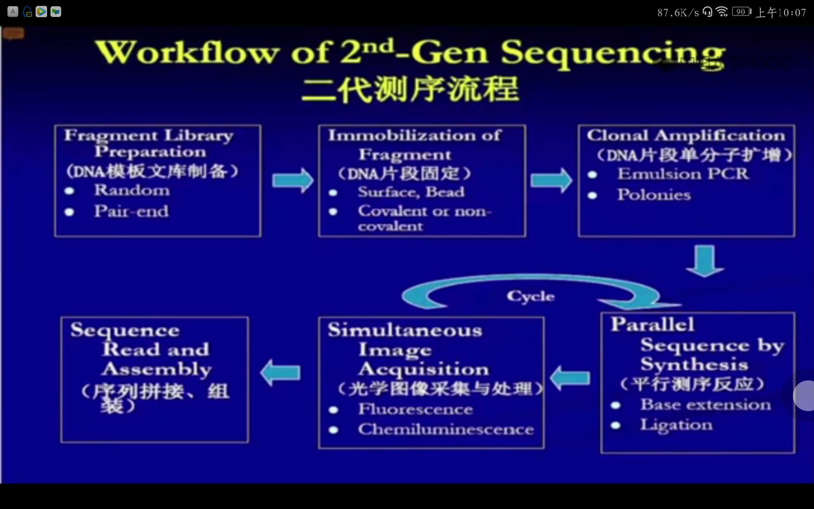
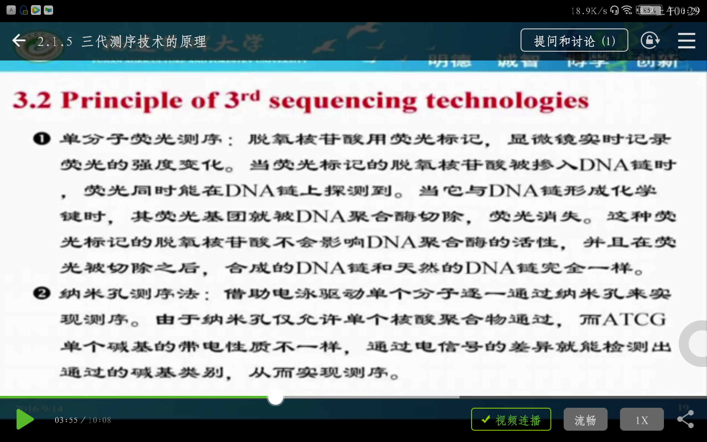
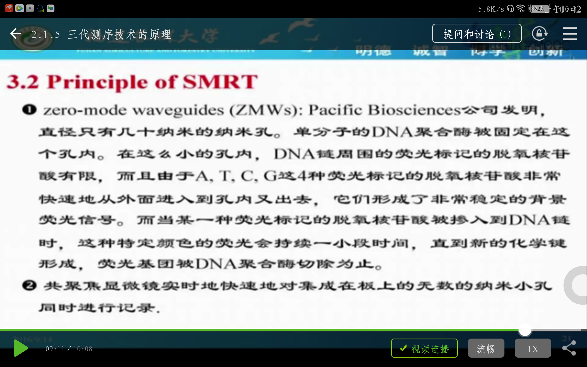
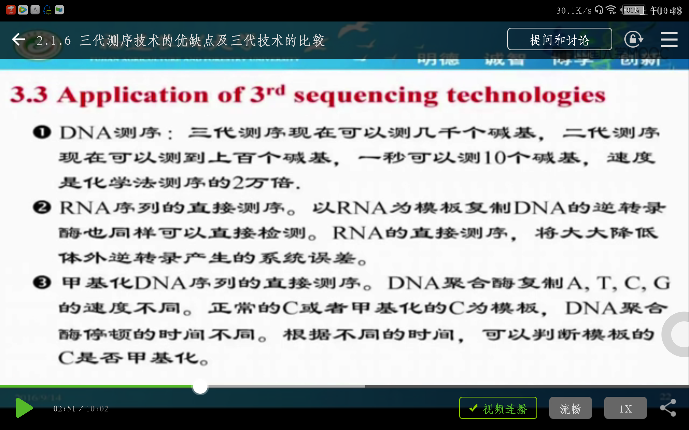
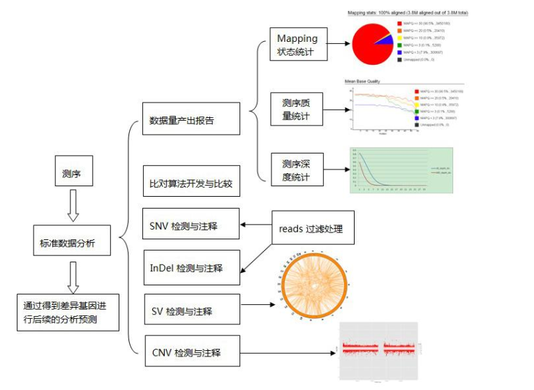

## 基因组测序技术

Workflow of NGS 二代测序流程

1. Sample fragmentation
2. Library preparation
3. Clonal Amplification
4. Sequencing reaction
5. Data analysis

Principle of SMRT

1. Millions of zero-mode waveguides (ZMWs), embedded with only one set of enzymes and DNA template that can be detected during the whole process.
2. During the reaction, the enzyme will incorporate the nucleotide into the complementary strand and cleave off the fluorescent dye previously linked with nucleotide.
3. The camera inside the machine will capture signal in a movie format in real-time observation.

## 基因组测序方式与质量控制

### 测序方法简介

**3种测序方法**

- Single read 单端测序
- Paired-end read 双端测序
- Mate-pair read 配对测序

#### Single-read library

1. DNA sample is digested into 200-500bp fragments.
2. Primer and adaptors are ligated to the ends of fragments, respectively.
3. DNA fragments are linked to flow cell to generate DNA cluster (spots on flow cell of same sequences made by amplification).
4. Sequencing.

#### Paired-end library

1. Genomic DNA
2. Fragment DNA into 200-500bp.
3. Add adapter and primers in both ends of the sequence of interest.
4. Generate **clusters**.
5. Sequencing step - using modified dNTPs (ddNTPs) and primers for know sequences you read the reads by light signals.

#### Mate-pair library

1. Sequence fragmentation is made in bigger fragments (2-5 kb).

2. A addition of a Biotin in each 5' ends is done.

3. The sequence with correct addition of Biotin will circularize and after a wash, the sequencing with non-circularized fragment will be thrown away.

4. The circularized fragments will be cut with the biotin in the middle and size-selected (400-600 bp).

5. Sequencing is done normally: adapter with primer sequence addition, the fragments will be spotted and clustered, and sequencing.

   ​

参考学习下<http://www.cnblogs.com/huangshujia/p/3233693.html>，这是非常不错的讲解。

**Summary:**

1. 样本建库不同；
2. Single Read (SR) 只检测待测片段的 一端序列信息，PE或MP检测待测片段的两端序列信息；
3. 信息具有互补性。

### Sequencing read file format

#### Sequencing read file in Fasta format

第一行为描述行，以`>`开头，然后接序列信息

第二行是标准的单字母序列，有时加`*`号作为结束符

两个序列之间以空行分隔

- Reads are often stored in fasta files
- Separate file for forward and reverse pairs
- header line -- read name/pairing info
- sequence line -- nucleotides

#### Sequencing read file in Fastq format

1. Line 1 begins with a '@' character and if followed by a sequence identifier and an optional description.

2. Line 2 is the raw sequence letters.

3. Line 3 begins with a '+' character and is optionally followed by the same identifier (and any description) again.

4. Line 4 encodes the quality values for the sequence in Line 2, and must contain the same number of symbols as letters in the sequence.

   ​	The character '!' represents the lowest quality while '~' is the highest.

   ​

Most read are stored in fastq, 4 lines per read.

### Read quality control

Raw reads are always in fastq format. Usually, Quality score (Q-score) of a raw reads is used to measure the confidence in the base calling's identity.
$$
Q_{score} = - 10 * log_{10}P (P为碱基识别出错的概率)
$$
The higher $Q_{score}$, the lower $P_{error}$.

Tools could be used to check Q-score for raw reads, such as **fastqc**.

<http://www.bioinformatics.babraham.ac.uk/projects/>

- Delete the PCR primer
  -  先使用BWA软件进行mapping统计，然后再使用samtools rmdup进行去重复）
- Filter the raw reads with low Q-score.

## 从头组装及常用工具

两种组装方式

- *de novo* assembly （从头拼接）
- reference assembly （参考拼接）

面对的问题：

- 不同组装形式有不同的软件工具；
- 不同软件工具适用于不同数据类型；
- 不同软件工具的参数要根据需要作调整；
- 得到大量contigs和scaffolds，留下大大小小的未知区（gaps）。

### Popular tools for *de novo* assembly

| 测序平台            | *de novo* 拼接工具                           |
| --------------- | ---------------------------------------- |
| ABI SOLiD       | Velvet                                   |
| Illumina Solexa | Velvet; SOAPdenovo; ABySS; CLC Genomics Workbench |
| 454/Ion Torrent | Newbler                                  |

- Velvet: 参数多，可控性强，可做scaffold
- ABySS: 傻瓜式
- SOAPdenove: 参数多，可做scaffold
- CLC: 商业化软件，可视界面
- NewBler: 商业化软件，可视界面，适合较长reads

Velvet; SOAPdenovo为常用工具

Velvet

- 拼接准确度高，对数据的通量要求不高；可以同时处理多种格式数据。
- 速度偏慢，耗内存。

SOAPdenovo

- 拼接速度快，占内存小，但是准确度没Velvet高。
- 能处理多种格式数据。尤其适合处理Solexa测序的数据。能够寻找contig的末端之间的关联信息生成scaffold。

[ 测序技术迄今为止已发展了三代，测序技术有4个指标：读长、成本、准确度、通量。](https://www.zhihu.com/question/42132384)

### 组装流程及评估

补gap

1. 利用pair-end或mate-end
2. 利用参考基因组

参考课件文档。

### 组装效果评价

**N50**

- N50, N75 and N90 are statistics of a set of contig or scaffold lengths.
- N50定义为the shortest sequence length at 50% of the genome.
- The number of bases from all contigs shorter than the N50 will be close to the number of bases from all contigs longer than the N50.

For example:

- 9 contigs with the lengths 2,3,4,5,6,7,8,9 and 10, their sum is 54.
- 如果基因组大小也恰好为54.
- 50% of this assembly would be 10+9+8=27.
- Thus the N50=8 wich is that contig along with the smaller contigs that contains half of sequence of particular genome.

N50越大越好（最重要的参数）。

**其他参数**

- 覆盖率：基因组被测序数据覆盖的次数
- 单碱基错误率：与参考序列比较后发现的小尺度碱基不同所占的比例。
- 错误组装的contigs
- N75, N90.

## 转录组测序与分析

C值（基因组大小）悖论：基因组大小与基因数目N不对称

- 进化程度低的生物C值反而更高
- 亲缘相近的物种间C值差异很大
- C值远远超过了遗传信息量的需求

## 基因组重测序

基因组重测序是对基因组序列已知的个体进行基因组测序， 并在个体或群体水平上进行差异
性分析的方法。

优点： 数据量大， 可以获取大量的有用信息，构建超精细图谱， 可以进行不同的性状关联分
析， 为基因定位提供大量高效依据， 可以对物种的起源， 进化以及变异情况进行详细了解。  

## 核酸数据库

### DNA序列数据库

GeneBank, EMBL, DDBJ

Other sequence repositories:

- BIOSINO: www.biosino.org, China
- dbEST - Database of Expressed Sequence Tags (NCBI)
- dbSTS - Database of Sequence  Tagged Sites (NCBI)

Genomic Databases:

- GenomeWeb (HGMP)
- NCGR
- GOLD

DNA 3D Databases:

- NDB
- BNASDB

Others

- AsDb - Aberrant Splicing db
- ACUTS - Ancient conserved untranslated DNA sequences db
- Codon Usage Db - The frequency of codon use ...

EPD - Eukaryotic Promoter db

PLACE - Plant cis-acting regulator ...

HOVERGEN - Homologous Vertebrate Genes db

IMGT - ImMunoGeneTics db

ISIS - Intron Sequence and Information System

RDP - Ribosomal db Project

gRNAs db - Guide RNA db

### Database Query Tools

1. SRS (Sequence Retrieval System)

   ​

