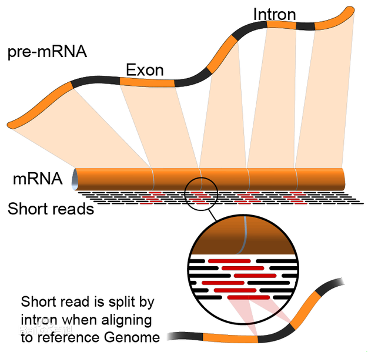

# Bioconductor分析RNA-seq数据

参考学习《R语言与Bioconductor生物信息学应用》第六章

---

如果想了解测序基本原理和知识，查看我整理的[测序与平台](http://www.jianshu.com/p/3f38a63572bb)。

使用的学习数据：NCBI SRA (Sequence Read Archive)数据库，数据集编号SRA091277

使用的是菊花转录组样品，分析过程包括原始数据获取、数据清理、质量控制、转录组拼接、转录本定量、标准化和表达差异分析等过程。

| 样品名称  | 样品描述         | RUN编号     | 测序长度  |
| ----- | ------------ | --------- | ----- |
| T1    | 处理组（脱水处理3小时） | SRR921340 | 100bp |
| T2    | 处理组（脱水处理3小时） | SRR921341 | 100bp |
| T3    | 处理组（脱水处理3小时） | SRR921342 | 100bp |
| T1-1  | 处理组（脱水处理3小时） | SRR921346 | 51bp  |
| T2-1  | 处理组（脱水处理3小时） | SRR921344 | 51bp  |
| T3-1  | 处理组（脱水处理3小时） | SRR921345 | 51bp  |
| CK1   | 对照组（不做任何处理）  | SRR921321 | 100bp |
| CK2   | 对照组（不做任何处理）  | SRR921322 | 100bp |
| CK3   | 对照组（不做任何处理）  | SRR921324 | 100bp |
| CK1-1 | 对照组（不做任何处理）  | SRR921336 | 51bp  |
| CK2-1 | 对照组（不做任何处理）  | SRR921337 | 51bp  |
| CK3-1 | 对照组（不做任何处理）  | SRR921338 | 51bp  |


## 高通量测序基础知识

（这里只记录书中重要的知识点并加以理解）

基于第二代测序建立起来的基因组测序、RNA-seq和Small RNA-seq等应用，都由**样本收集、文库制备和测序**三个过程组成，不同之处在于样品收集和文库制备。



第二代测序仪（Illumina）测的序列，无论来自DNA-seq文库还是RNA-seq文库，从左到右依次分为3个区域：**5'接头（Adapter）区、目标序列区和3'接头区**。当多个样品在一个泳道（Lane）中同时测序时，我们可以使用多样品（Multiplex）技术，具体而言是给每个样品分配一个不重复的条形码（Barcode），其实质是一个6-8位的DNA序列，测序后可以通过这个序列将不同的样品分开。**单端测序**（Single end）指仅从正向测序；**双端测序**（Paired end）指先从正向测序，然后从反向测序。Barcode则根据另一引物“Sb”独立测序得到。

理论上，由于制备的RNA-seq文库插入长度的峰值常常为200或300bp，所以测序应该只得到文库中目标序列5'端开始的部分（这就是常说的read了，以前总搞不懂~）。但是呢，文库中会有少量目标序列不到测序长度（比如测100bp实际目标序列只有几十），那么测序就可能会测到3'端接头序列，这就是所谓的**接头污染**。数据预处理时，如果发现接头序列过多，一般是RNA-seq文库插入长度没有控制好；如果出现大量全长的3'接头，一般是接头过量，导致了大量接头自连（Self ligation）。

实际应用中，估计测序深度使用更多的是达到质量标准的有效数据量，而不是原始数据量。当RNA-seq有效数据比例过低时，无法检测一些低丰度的转录本，要考虑重新测序。

**测序深度**，也叫乘数，指每个碱基被测序的平均次数，是用来衡量测序量的首要参数。**测序覆盖度**，也叫覆盖率，指被测序到的碱基占全基因组大小的比率。假如用Illumina 2000测序仪完成一次人类基因组（3G大小）单端测序，即可得到300G数据（假设全部是有效数据），估计的测序深度即为100倍（300G/3G），常见表示为100X。将所有读段比对到人类基因组，如果发现只有2.7G的碱基至少有1个读段覆盖到，其实际测序深度为111X（300G/2.7G），测序覆盖度为90%（2.7G/3G）。

**不同的测序目的要使用不同的测序策略**。如DNA组装使用较多的是2X100bp或更长的双端测序；RNA-seq使用较多的是100bp或更长的单端链特异性测序；small RNA-seq多用50bp单端测序。

从测序得到的读段组装成目标基因组或者转录组的基因策略是**比对和拼接**，比对是把读段定位到参考基因组或者转录组上，然后再拼接成连续序列；拼接也胶从头组装（*Denovo* assembly），是在没有参考基因组或者转录组前提下，根据读段之间的重叠区，把所有读段拼接起来，直接获得基因组或者转录组（[参考文章](http://www.mamicode.com/info-detail-1901076.html)）。

转录组比对常用的软件有BWA、Bowtie和Tophat；拼接常用的软件是Trinity。

**基因组和转录组组装的不同点**：基因组组装希望尽量获得唯一或较少的组装结果，即**一致性序列**（Consensus sequence）。一致性序列上并不是每个位点都只有一种碱基，它实际上只代表该位点出现频率最高的碱基，存在两种以上碱基的位点叫做**杂合位点**。注意，过分追求一致性会导致**过拼接**，即来自不同基因的相似序列会被误拼接到一起。基因组和转录组组装可以用一个非常重要的指标**N50**来评价，即将所有组装后的序列按照长度从大到小排列，累加值接近所有序列长度总和一半时的那个位置对应的序列长度。N50越大，组装的结果越好，类似的有N90。


### 测序的质量分数

#### Phred分数

测序中常用错误概率$P_e$（Error probability）来表示每个核苷酸测量的准确性，还可以赋予一个数值来更简便地表示这个意思，叫做测序质量分数（Quality score）。因为这个分数最开始通过Phred软件从测序仪生成的色谱图中得到的，所以也叫做Phred分数（$Q_{Phred}$）。Phred分数的取值范围是0到93，可以表示很宽的误差范围，即从1（完全错误）到非常低的错误率$10^{-93}$。Phred分数是最基本的质量分数，其他的质量计分标准都来自Phred分数。
$$
Q_{Phred} = -10\times log_{10}P_e
$$

| $Q_{Phred}$ | $P_{e}$ | Base call accuracy |
| ----------- | ------- | ------------------ |
| 0           | 1       | 0                  |
| 10          | 0.1     | 0.9                |
| 20          | 0.01    | 0.99               |
| 30          | 0.001   | 0.999              |
| 40          | 0.0001  | 0.9999             |
| 50          | 0.00001 | 0.99999            |

#### Sanger分数（Phred+33）

Phred分数包括2位数字，还需要用空格分隔，不方便阅读，又要占用大量存储空间，实际上文件中不采用它。为了在文件中方便地表示质量，常常将Phred分数加上33（从33到126变化，ASCII码正好覆盖了可打印区），并用其ASCII码值对应的字符表示，这就是Sanger分数。Sanger分数常用于FASTQ格式的文件。

#### Illumina/Solexa分数（Phred+64）

分数之间的转换公式：
$$
Q_{Solexa} = -10 \times log_{10}(\frac{P_e}{1-P_e}) \\

Q_{Solexa} = 10 \times log_{10}(10^{\frac{Q_{Phred}}{10}}- 1) \\

Q_{Phred} = 10 \times log_{10}(10^{\frac{Q_{Solexa}}{10}}- 1) \\
$$
Solexa分数的取值范围是-5到62，它在FASTQ文件中需要加上64并转换为相应的ASCII码值（59到126）对应的字符来表示质量。2006年，Illumina公司收购Solexa公司后继续沿用其标准。显著Illmina采用新的标准，采用了Phred分数（范围0-62）加64的质量分数。

Sanger分数（Phred+33）和Illumina分数（Phred+64）是当前应用最为普遍的质量分数系统。

以Phred=20（即常见的Q20标准）为例，其Sanger分数为53，对应数字5；其Illumina分数为84，对应字母T。

Bioconductor中的ShortRead包提供了SolexaQuality和PhredQuality函数分别生成Illumina分数和Sanger分数。

```R
source("http://Bioconductor.org/biocLite.R")
biocLite("ShortRead")
library(ShortRead)
Q=20
PhredQuality(as.integer(Q))
SolexaQuality(as.integer(Q))
```

```R
> Q=20
> PhredQuality(as.integer(Q))
  A PhredQuality instance of length 1
    width seq
[1]     1 5
> SolexaQuality(as.integer(Q))
  A SolexaQuality instance of length 1
    width seq
[1]     1 T
```


### 高通量测序文件格式

#### FASTQ格式

FASTQ格式是序列文件中常见的一种，它一般包括四部分：第一部分是由“@”开始，后面跟着序列的描述信息（对于高通量数据，这里是读段的名称），这点跟FASTA格式是一样的（起头的符号不一样）；第二部分是DNA序列；第三部分是由“+”号开始，后面或者是读段的名称，或者为空；第四部分是DNA序列上每个碱基的质量分数，每个质量分数对应一个DNA碱基。

Bioconductor中的ShortRead包提供了quality函数可以自动识别FASTQ文件中的质量分数的种类。

我随便写了一个fastq的demo文件，内容

```
@HWUSI-EAS100R:123:COEPYACXX:6:73:941:1973#0/1
GATTTGGGGTTCAAAGCAGTATCGATCAAAATAGTAAAATCCATTTGTTCAACTCACAGTTT
+ HWUSI-EAS100R:123:***********************
!"************************************************************
```

进行一些操作：

```R
library(ShortRead)
# 读入FASTQ文件
reads <- readFastq("./demo.fastq")
# 得到质量分数的类型
score_sys <- data.class(quality(reads))
# 得到质量分数
qual <- quality(quality(reads)) # 这里好像一个quality函数就够了，还是尊重原文吧
# 质量分数转为16进制表示
myqual_mat <- charToRaw(as.character(unlist(qual)))

# 如果是Phred+64分数表示系统
if(score_sys=="SFastqQuality"){
  # 显示分数系统类型
  cat("The quality score system is Phred+64", "\n")
  # 输出原始分数值
  strtoi(myqual_mat, 16L)-64
}
# 如果是Phred+33分数表示系统
if(score_sys=="FastqQuality"){
  # 显示分数系统类型
  cat("The quality score system is Phred+33", "\n")
  # 输出原始分数值
  strtoi(myqual_mat, 16L)-33
}

```

```R
The quality score system is Phred+33 
 [1] 0 1 9 9 9 9 9 9 9 9 9 9 9 9 9 9 9 9 9 9 9 9 9 9 9 9 9 9 9 9 9 9 9 9 9 9 9 9 9 9 9 9 9 9 9 9 9 9 9 9 9 9 9 9 9 9 9 9 9 9 9 9
```


#### NCBI中的FASTQ与SRA格式

NCBI的Sequence Read Archive （SRA）数据库，接受FASTQ格式的高通量数据上传，并**将分数标准从开始的Illumina分数转换成了Sanger分数**。而且，NCBI在读段名称前面增加了数据在SRA库的编号和版本，后面增加了读段的长度。SRA数据库为了节省存储空间，将FASTQ文件压缩为二进制的SRA格式进行保存。用户如果下载SRA格式数据，可以使用**工具软件fastq-dump**将数据从SRA格式转回FASTQ格式。


#### QUAL格式文件

Solid测序仪产生分离的序列文件（CSFASTA格式）和质量文件（QUAL格式），两者必须成对出现。QUAL文件采用Phred分数，而且行必须与FASTA文件中的行一一对应。CSFASTA文件与FASTA格式看似相同，但实际不同，Solid不是用核苷酸残基表示序列数据，而是采用了颜色空间的表示方法。Solid的序列文件如果和质量文件合并，可以产生CSFASTAQ格式的文件，也可以根据颜色编码转为真正的FASTAQ格式的文件。

Solid的结果文件转为标准FASTQ格式的文件需要注意**两个问题**：**第一**是第1个碱基由于来自测序引物，必须删除；**第二**就是由于Solid颜色空间的编码是前后依赖的，一旦错一个，会导致后面连续错误，一般都将参考基因组反转为颜色空间编码再进行比对等分析，而不主张将Solid的结果文件直接转换为FASTQ文件。

关于常见的生信数据文件格式，参见[生信常见数据格式](http://www.jianshu.com/p/a28ff2397d99)。


### RNA-seq技术的特点

#### RNA-seq对芯片的优势

RNA-seq检测基因表达主要在7个方面比基因芯片有优势。

|       | 基因芯片 | RNA-seq |
| ----- | ---- | ------- |
| 参考序列  | 需要   | 不需要     |
| 动态范围  | 小    | 大       |
| 背景噪声  | 大    | 小       |
| 受降解影响 | 大    | 小       |
| 序列变异  | 无法检测 | 可以检测    |
| 转录组方向 | 不能确定 | 能确定     |
| 可重复性  | 一般   | 高       |

#### RNA-seq存在的问题

- RNA-seq测序之前需要一个比较复杂的文库构建过程，这个过程的每一步都可能带来误差甚至导致实验失败。如cDNA片段化、PCR扩增等都会带来偏倚，最终导致有的片段被反复测了多次，有的没有测到。rRNA去除不干净等因素也会带来大量污染（即非目标序列）。还有其他一些实验问题。
- RNA-seq检测灵敏度和最大值是随测序深度变化的，深度不够，不能发现超低表达的转录本，需要在测序前预估转录本大小。而由于复杂的RNA编辑等原因，高等生物的转录组与其编码基因数量没有固定比例关系，所以预估容易产生较大误差。
- 参考基因组或转录组不准确、测序误差、错误拼接或比对带来的错误会大大影响各种变异或者可变剪切事件的识别。
- 各种其他的问题。比如整个实验流程可能引进了各种污染；原始数据预处理的数据模型不完善等等。

**下面看一下如何计算由测序误差引起的Barcode的错误分配**，假设Barcode（Barcode唯一确定样本）长度为6个碱基，每个Barcode两两之间两个碱基不同，所有的Barcode都用满，同时假设错误的发生符合二项分布，那么只要2个碱基错误，就会发生一次错误分配，在Illumina测序仪每个碱基的平均错误率0.5%的前提下，下面例子可以计算出一个泳道的错误错误分配概率。

```R
> p = 0.0005
> sum(sapply(2:6, FUN=function(k) choose(6,k)*p^k*(1-p)^(6-k)))
[1] 3.745003e-06
```

也就是说，在一个泳道，每百万读段就会有370个读段分配错误。如果还考虑DNA簇混合和跳跃PCR引起的Barcode错误分配，这个数值还要高很多。这种分配错误对一般的转录组分析没有影响，但是对一些高灵敏度的突变检测项目影响很大。

```
Illumine 2000测序仪中，一次运行（Run）可以使用2个流动槽（Flow cell），每个流动槽包括8个泳道（Lane），一个泳道包含2个面（Surface），每个面还有3个条（Swath）也叫列（Column），每一列由16个小区（Tile）组成，后者又由大量DNA簇（Cluster）组成。

Illumine 2000测序仪每次运行（单端测序）理论上可以产生大约30亿个DNA簇，每个DNA簇理论上可以产生一条读段（Read），如果测序长度为100bp，一次运行可以得到3G个读段，其原始数据量为300G个碱基。
```

