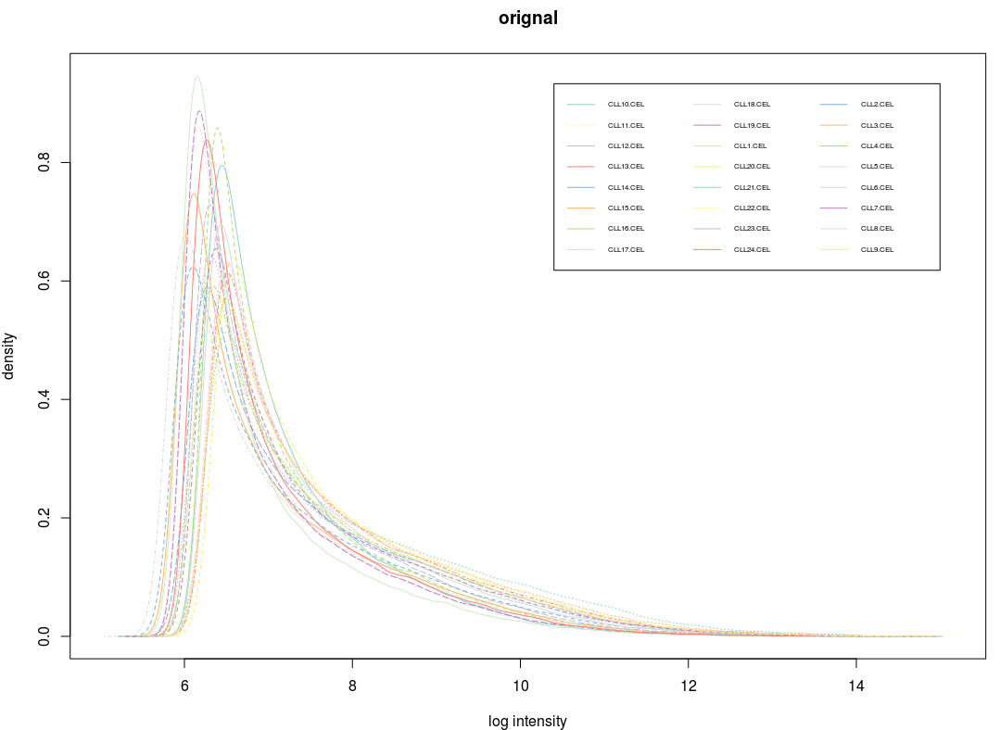
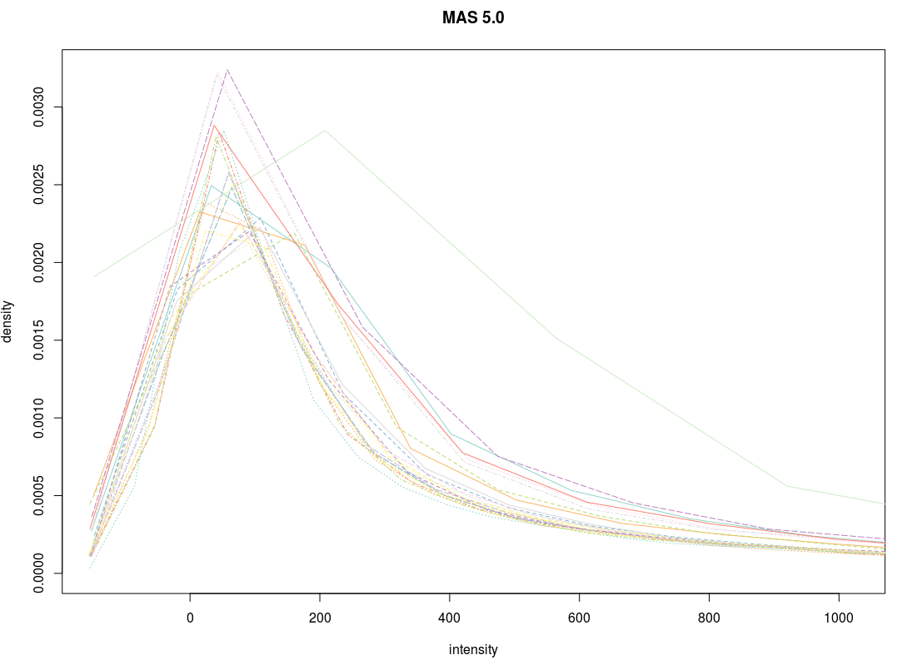
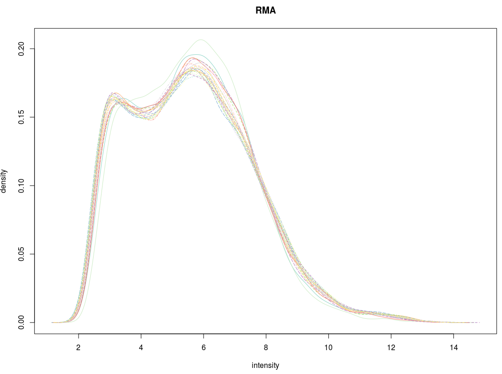
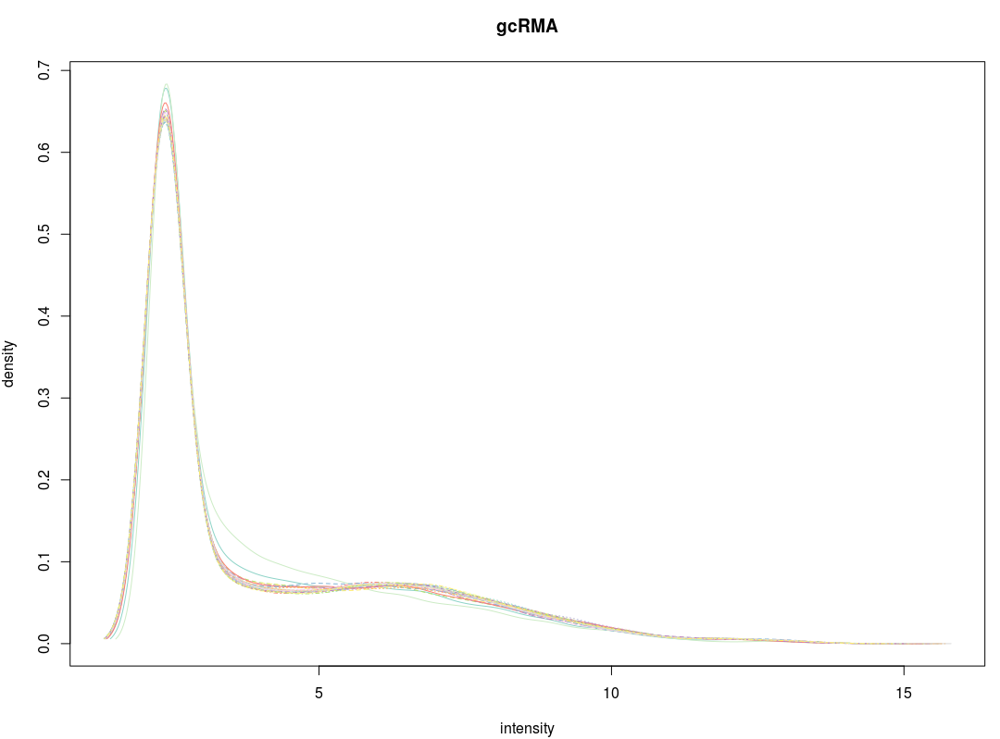
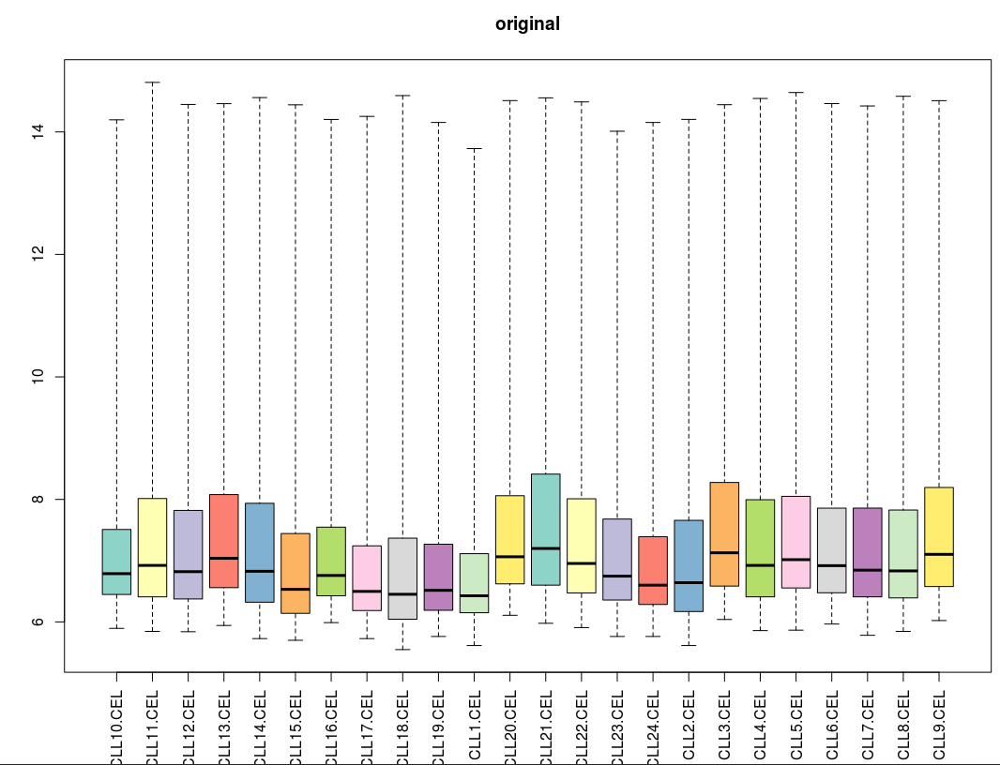
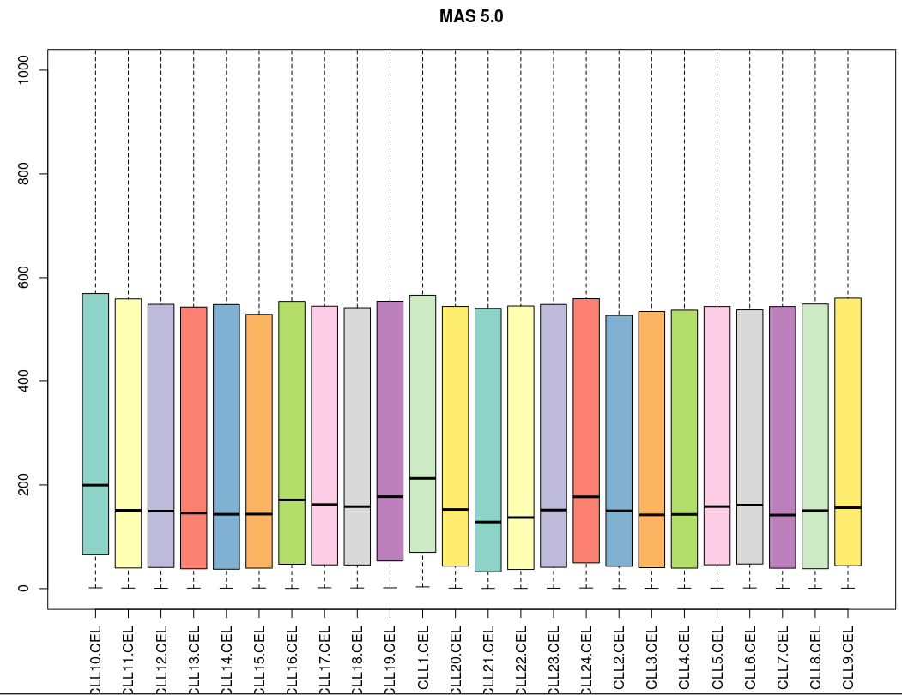
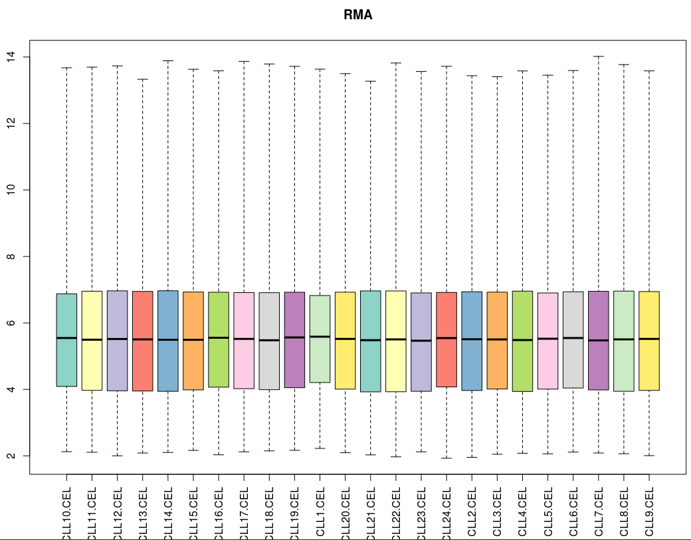
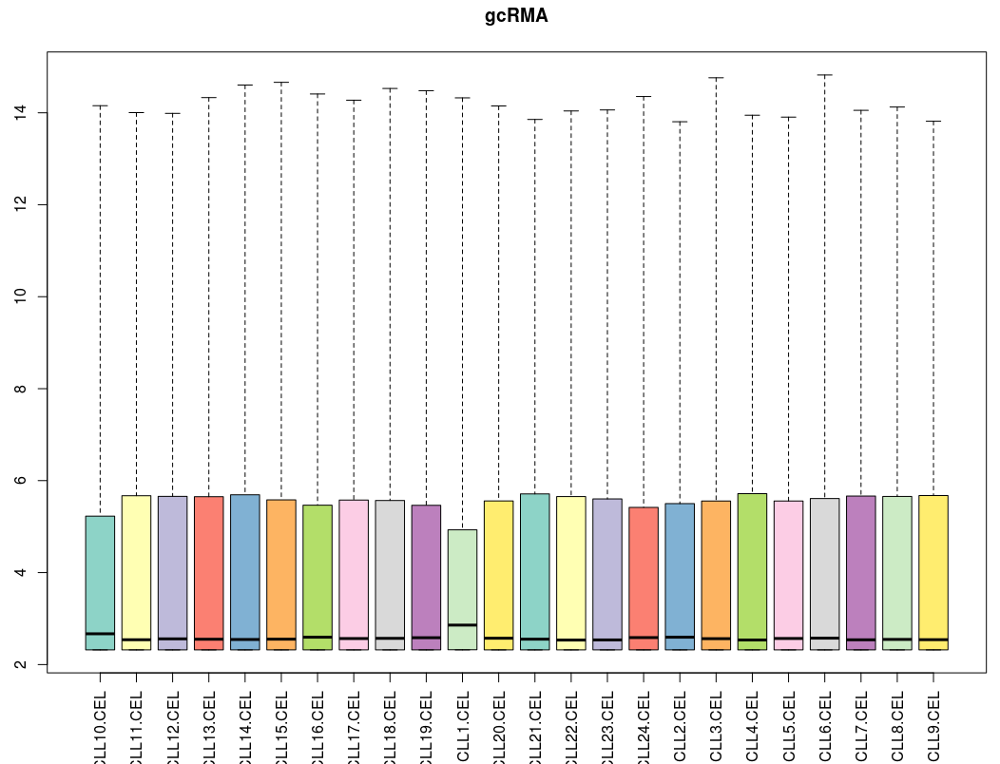
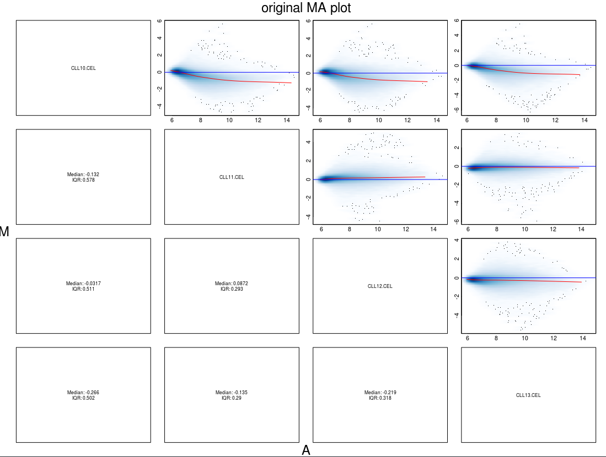
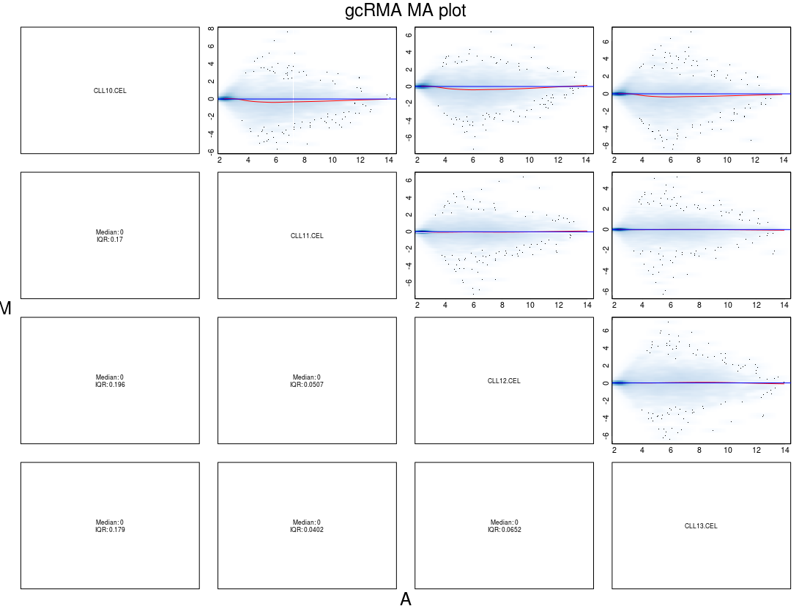

# Bioconductor分析基因芯片数据

*参考学习《R语言与Bioconductor——生物信息学应用》第五章*，根据自己学习有删改，版权为原作者所有，欢迎分享。本文中有些预备知识或一些方法的原理没有提及，请自行搜索理解或者购买该书学习。

**Bioconductor最初就是设计来分析基因芯片数据的，因此芯片分析整体反映了Biocondutor的设计理念和编程思想。**

## 快速入门

通过一个例子了解如何载入芯片数据，完成预处理，最后获得基因（探针组）表达矩阵。

```R
# install CLL package
# library(BiocInstaller)
# biocLite("CLL")

# 载入CLL包，CLL包会自动调用affy包，该包含有一系列处理函数
library(CLL)
# read example dataset，（CLL包附带的示例数据集）
data("CLLbatch")
# pre-process using RMA method
CLLrma <- rma(CLLbatch)
# read expression value after pre-processing
e <- exprs(CLLrma)
# 查看部分数据
e[1:5, 1:5]
```

数据输出如下：

```R
> e[1:5, 1:5]
          CLL10.CEL CLL11.CEL CLL12.CEL CLL13.CEL CLL14.CEL
100_g_at   7.495697  7.945159  7.861043  7.990252  7.889718
1000_at    7.251120  8.298723  8.473531  8.131041  8.051400
1001_at    4.457362  4.517529  4.357791  4.651236  4.473598
1002_f_at  3.984693  3.981675  4.065171  4.132480  4.065022
1003_s_at  6.437046  6.200826  6.412218  6.313572  6.105120
```

对象`e`是一个12625行、24列的基因表达矩阵。可以看到，我们仅用了不到10行代码就完成了整个芯片的预处理过程。

**关于探针组**

> 一张基因芯片包含上百万的探针，它们被整齐有序地印刷再芯片上。探针组（probe set）来自于一个基因，通常由20对或者11对探针组成。每一对探针都由匹配探针（PM）和错配探针组成，称为探针对。
>
> 探针序列地来源叫做参考序列，通常来自于公开的核酸数据库。不同的芯片类型，探针组在参考序列中的分布不同。
>
> 这里有一个概念误区需要注意：芯片数据中的基因表达矩阵往往是以探针组而不是以基因为单位的，每行都对应一个探针组的表达量。我们一般通过ID映射才对应到探针组代表的基因，它们的关系常常为多个探针组对应一个基因。实际应用中则不太注意区分。

**关于芯片文件格式**

> 芯片实验结果获取数据主要通过两个步骤，第一步由扫描设备对芯片进行扫描，得到荧光信号图像文件（DAT文件）；第二步由系统自带的图形处理软件进行一系列图形处理与识别，从芯片图像中提取数据，得到CEL文件。
>
> Affymetrix芯片原始数据最常用格式为CEL格式，也是芯片数据预处理和分析的出发点。
>
> **CEL文件只提供了每个探针的灰度信息，还需要基因芯片探针排布的信息（哪个探针来自哪个探针组），才可以得到芯片上每个探针组对应的表达数据，这就需要CDF文件。**另一个重要的文件是Probe文件，它提供了探针的序列信息。
>
> 除了上述提到的几种文件格式，常见的还有EXP文件、CHP文件、TXT文件和RPT文件。TXT文件特指包含基因表达矩阵的TXT文件，CHP文件与TXT文件内容基本相同。


## 数据预处理

预处理的目的是**将探针水平的数据转换成基因表达数据**。主要的数据结构有AffyBatch类和ExpressionSet类，前者用于存储探针水平数据（相当于CEL文件内容），而后者用于存储表达水平的数据（基因表达矩阵）。

预处理通过质量控制，剔除不合格的芯片数据，只保留合格的进入下一步处理。然后通过标准化，将所有芯片数据中的基因表达值变换到一个可以比较的水平，用于后续分析。

### 数据输入

实际应用中，常见情况是从CEL文件中获得数据。在上一个例子中，数据包CLL中得到的芯片数据基本等同于CEL文件。

**无论是数据包还是文件输入，读入的数据会存入一个AffyBatch类型的对象中。**

```R
# load package
# library(CLL)

# load data
data(CLLbatch)

# view the data type
data.class(CLLbatch)

# load status info of all samples
data(disease)
# view
disease

# see help of AffyBatch
help("AffyBatch")
```

看一下输出的一些结果：

```R
> data.class(CLLbatch)
[1] "AffyBatch"
> disease
   SampleID  Disease
1     CLL10     <NA>
2     CLL11 progres.
3     CLL12   stable
4     CLL13 progres.
5     CLL14 progres.
6     CLL15 progres.
7     CLL16 progres.
8     CLL17   stable
9     CLL18   stable
10    CLL19 progres.
11     CLL1   stable
12    CLL20   stable
13    CLL21 progres.
14    CLL22   stable
15    CLL23 progres.
16    CLL24   stable
17     CLL2   stable
18     CLL3 progres.
19     CLL4 progres.
20     CLL5 progres.
21     CLL6 progres.
22     CLL7 progres.
23     CLL8 progres.
24     CLL9   stable
```

> CLL数据集存储了24位癌症病人样本的数据，所有病人根据健康状态分为两组：稳定期（Stable）组和进展组（Progressive）。


**AffyBatch类**

> Biobase软件包中，AffyBatch类是从一个更基础的类eSet类衍生来的。eSet类非常重要，它被写成了一个虚类，衍生出许多非常重要的类，包括ExpressionSet类，SnpSet类以及AffyBatch类等。eSet是Bioconductor为基因表达数据格式所定制的标准，因此非常有必要熟悉eSet及其衍生类。

```R
> phenoData(CLLbatch)
An object of class 'AnnotatedDataFrame'
  sampleNames: CLL10.CEL CLL11.CEL ... CLL9.CEL (24 total)
  varLabels: sample
  varMetadata: labelDescription
> featureData(CLLbatch)
An object of class 'AnnotatedDataFrame': none
> protocolData(CLLbatch)
An object of class 'AnnotatedDataFrame': none
> annotation(CLLbatch)
[1] "hgu95av2"
> exprs_matrix <- assayData(CLLbatch)[[1]]
> exprs_matrix[1:5, 1:5]
  CLL10.CEL CLL11.CEL CLL12.CEL CLL13.CEL CLL14.CEL
1     183.0     113.0     119.0     130.0     133.0
2   11524.8    6879.8    7891.3    8627.5    8205.3
3     301.0     146.0     133.0     160.0     153.0
4   11317.0    6747.0    7916.0    8616.0    7865.0
5     115.0      82.0      78.8     101.0      65.3
> exprs(CLLbatch)[1:5, 1:5]
  CLL10.CEL CLL11.CEL CLL12.CEL CLL13.CEL CLL14.CEL
1     183.0     113.0     119.0     130.0     133.0
2   11524.8    6879.8    7891.3    8627.5    8205.3
3     301.0     146.0     133.0     160.0     153.0
4   11317.0    6747.0    7916.0    8616.0    7865.0
5     115.0      82.0      78.8     101.0      65.3
```

- assayData槽是AffyBatch类必不可少的，其方法返回结果的第一个元素是矩阵类型，用于保存基因表达矩阵。该矩阵的行对应不同的探针组，用一个无重复的索引值表示；列对应不同的样本。当使用exprs方法时，调取的就是这个基因表达矩阵。
- experimentData槽是一个MIAME（Minimum Information About a Microarray Experiment）类型的数据，设计这个MIAME类的目的就是用于保存MIAME原则建议的注释信息。该原则建议了一组标准用来记录与基因芯片实验设计相关的资料。

结果中可以看到`phenoData(CLLbatch)`结果没有每个样品对应的表型信息。因为CLL包采用了一个数据框类型的变量disease来保存每个样本的表型信息。其实，将表型信息存入数据结构CLLbatch中是更为规范的做法。


### 质量控制

这里的质量控制主要集中在CEL文件级别的处理，**从最简单的直接观察，到平均值方法，再到比较高级的数据拟合方法**。这三个层次的质量控制功能分别由image函数、simpleaffy包和affyPLM包实现。

我们先直观地看一下芯片上所有位点的灰度图像。

```R
# 查看第一张芯片的灰度图像
image(CLLbatch[,1])
```


芯片左上角的花纹和芯片名称可以帮助我们来了解芯片数据是否可靠。根据图像信息，可以对芯片的信号强度产生一个总体认识：图像特别黑，信号强度低；图像特别亮，信号可能过饱和。


很显然这种方法非常粗糙，不能量化。比它好的简单方法是基于各种平均值的方法。**这类方法的一个共同特点就是假设一组实验中的每个芯片数据对于某个平均值指标都相差不大**。Affymetrix公司在指导手册中进行了详细描述。

- 尺度因子（Scaling factor）：用于比较地芯片之间地尺度因子地比例必须小于3
- 检测值（Detection call）和检出率（Percent present）：一组探针能否被检测到，用检测值有（Present，简称P）、无（Absent，简称A）和不确定（Marginal present，简称M）来表示。
- 平均背景噪声（Average background）
- 标准内参（Internal control genes）:大部分的细胞有$\beta$-actin和GAPDH基因...

根据上述的这些标准，使用Bioconductor的simpleaffy包对Affymetrix芯片数据进行质量评估，最后得到质量控制总览图。

```R
## use simpleaffy package
library(BiocInstaller)
biocLite("simpleaffy")
library(simpleaffy)
library(CLL)
data(CLLbatch)
# acquire analysis report
Data.qc <- qc(CLLbatch)
# visualize report
plot(Data.qc)
```


上图显示的是全部数据的质量控制总览图。第一列是所有样本的名称；第二列是两个数字，上面的是以百分比形式出现的检出率，下面的数字表明平均背景噪声。第三列（“QC Stats”）最下面的横轴是尺度因子等指标对应的坐标，取值范围从-3到3。第3列用到了三项指标：尺度因子、GAPDH 3'/5' 比值和actin 3'/5'比值，分别用实心圆、空心圆和三角标志表示出来。如果出现红色的“bioB”字样，说明该样品中未能检测到BioB。

简单地讲，**所有指标出现蓝色表示正常，红色表示可能存在质量问题**。但这样根据实际情况进一步分析。一般来讲，如果有一个芯片各项指标都不太正常，尤其是BioB无法检测到，建议判定该芯片实验失败。比如CLL15.CEL这个数据的检出率明显低于其他样品，actin3/actin5远大于3，而且没有检测到BioB，因此数据可以判定为无效。


**基于平均值假设的评价指标都有一个默认的假设，那就是对于每一块芯片，质量是均匀的，不会随位置不同发生较大的变化**。但事实上，芯片的每一个小格之间的质量也是有差异的。

如何得到比较可靠的质量评估呢？这需要设计多种能反映芯片数据全貌的指标综合分析从而得到最终的结论。**这些指标要在对原始数据拟合的基础上计算得到**，以图形显示，包括权重残差图、相对对数表达箱线图、相对标准差箱线图、RNA降解曲线、聚类分析、主成分分析、信号强度分布图与MA图等等。以上功能可以通过affyPLM包实现。

```R
## use affyPLM package
biocLite("affyPLM")
library(affyPLM)
library(CLL)
data(CLLbatch)
# 对数据集做回归分析，结果为一个PLMset类型的对象
Pset <- fitPLM(CLLbatch)
image(CLLbatch[,1])
# 根据计算结果，画权重图
image(Pset, type="weights", which=1, main="Weights")
# 根据计算结果，画残差图
image(Pset,  type="resids", which=1, main="Residuals")
# 根据计算结果，画残差符号图
image(Pset, type="sign.resids", which=1, main="Residuals.sign")
```

affyPLM包在探针水平拟合时引入了加权最小二乘法来进行回归，理论上，权重和残差 的分布是随机的，应该看到绿色均匀分布的权重图和红蓝均匀分布的残差图。

相对对数表达箱线图（RLE）反映了基因表达量的一致性趋势，它**定义为一个探针组在某个样品的表达值除以该探针组在所有样品中表达值的中位数后取对数**。

如果使用RLE箱线图来控制CLL数据集的实验质量，**每个样品的中心应该非常接近纵坐标0的位置**。如果个别样品的表现与其他大多数明显不同，那说明可能这个样品可能有问题。下面我们根据这个数据集来看看。

```R
## 
biocLite("RColorBrewer")
# library(affyPLM)
library(RColorBrewer)
colors <- brewer.pal(12, "Set3")
# RLE
Mbox(Pset, ylim=c(-1, 1), col=colors, main="RLE", las=3)
# NUSE
boxplot(Pset, ylim=c(0.95, 1.22), col=colors, main="NUSE", las=3)
```


NUSE是一种比RLE更为敏感的质量检测手段。我们可以结合NUSE图来确定是否某个芯片质量有问题。NUSE定义为一个探针组在某个样品的PM值的标准差除以该探针值在各样品中的PM标准差的中位数。**如果所有芯片的质量都是非常可靠的话，那么它们的标准差会非常接近，因此它们的NUSE值都会在1附近**。

> 然而，如果有些芯片质量有问题的话，就会严重地偏离1，进而导致其他芯片地NUSE值偏向相反的方向。当然，存在一种极端的情况，就是大部分芯片都出问题了，但是它们的标准差却比较接近，反而会显得没有质量问题的芯片的NUSE值会明显偏离1，所以必须结合两种图作出可靠的判断。


可以看到CLL1和CLL10的质量明显有别于其他样品，需要舍弃。

**RNA降解是影响芯片质量的一个很重要因素**。因为RNA是从5’端开始降解的，理论上5‘端的荧光强度应该低于3’端的荧光强度。如果RNA降解曲线的斜率太小，甚至接近于0，很可能是RNA降解太严重，需要作为坏数据去除（下图显示的CLL13）。

```R
# RNA degradation
# library(affy)
data.deg <- AffyRNAdeg(CLLbatch)
plotAffyRNAdeg(data.deg, col=colors)
legend("topleft", rownames(pData(CLLbatch)), col=colors, lwd=1, inset=0.05, cex=0.5)
```


```R
CLLbatch <- CLLbatch[, -match(c("CLL10.CEL", "CLL1.CEL", "CLL13.CEL"),
                              sampleNames(CLLbatch))]
```

去掉三个质量差的。

前面提到的质量控制方法都是**基于平均值思想**的，其实，我们还可以从芯片之间的相互关系来检验芯片的质量。理论上组内同种类型的芯片数据应该聚拢在一起，两个组之间应该明显地分离。Pearson线性相关系数就是最常用的这类指标，但在实际应用中，往往不是直接查看相关系数矩阵，而是根据由相关系数矩阵导出的**距离矩阵**，进行聚类分析或主成分分析以对样品归类并图形化显示。

```R
## cluster and PCA
# install packages
biocLite("gcrma")
biocLite("graph")
biocLite("affycoretools")

# load packages
library(CLL)
library(gcrma)
library(graph)
library(affycoretools)

# load data
data(CLL)
data(disease)
# pre-process using gcrma
CLLgcrma <- gcrma(CLLbatch)
# retrieve gene expression dataset
eset <- exprs(CLLgcrma)
# compute Pearson corr coeffience
pearson_cor <- cor(eset)
dist.lower <- as.dist(1 - pearson_cor)
# cluster
hc <- hclust(dist.lower, "ave")
# plot
plot(hc)
# PCA
samplenames <- sub(pattern = "\\.CEL", replacement = "", colnames(eset))
groups <- factor(disease[,2])
plotPCA(eset, addtext=samplenames, groups=groups, groupnames=levels(groups))
```


从聚类分析的结果来看，稳定组和恶化组根本不能很好分开。这还不能判定实验失败。**理论上讲，如果总体上两组数据是分开的，那么说明我们关心的导致癌症从稳定到恶化的因素起到了主要因素。如果不是，需要具体问题具体分析。**CLL数据的实验样本来自不同个体，而不是细胞，很可能个体差异起到了主导作用，因此导致聚类被整体打乱。所以只有当聚类图中有明显的类别差异时，才适合考虑去除个别不归类的样品；如果整体分类被打乱，则不能简单判定所有样品都出了问题。

芯片分析往往采用两个主成分来构建分类图，我们从下图可以看出两组根本就不能很好分开。


注意，使用主成分分析时，还必须考虑前2个主成分是否具有代表性，这要看前2个主成分的累计贡献率，如果低于60%，可以考虑采用多维尺度分析来构建分类图。


### 背景校正、标准化和汇总

芯片数据通过**质量控制**，剔除不合格的样品，留下的数据经过**背景校正、标准化和汇总**三步得到下一步分析用的基因表达矩阵。

实际中经常发现大量的MM（Mismatch）信号比PM（Perfect Match）信号还要高。我们需要应用复杂的统计模型来去除背景噪声，这叫作背景校正（Background correction）。

**标准化的目的**是消除测量间的非实验误差，使得实验条件下的测量可以相互比较。芯片数据标准化根据基本假设分为“bulk normalization"与"control-based normalization"两种。前者假定仅有一小部分基因表达值在不同条件下有差异，因此使用所有的基因表达值作为参考进行标准化；后者使用表达值被认为恒定不变的参考基因作为标准进行标准化。实际应用中一般只采用第一种。

最后，我们使用一定的统计方法**将前面得到的荧光强度值从探针水平汇总到探侦组水平**，这个过程被称为汇总（Summarization）。

上述三个步骤可以由affy包的expresso函数实现，我们可以设定不同的参数来指定具体采用的方法。

```R
# 在前面分析的基础上
eset.mas <- expresso(CLLbatch, bgcorrect.method = "mas", normalize.method = "constant", pmcorrect.method = "mas",
                     summary.method = "mas")
```

可以看到函数的调用非常简单，但参数很多，理解比较复杂。想要了解所有参数的含义，使用`help(expresso)`命令获取参数说明。

下面命令可以查看可选的参数：

```R
> bgcorrect.methods()
[1] "bg.correct" "mas"        "none"       "rma"       
> normalize.methods(CLLbatch)
 [1] "constant"           "contrasts"          "invariantset"       "loess"              "methods"            "qspline"           
 [7] "quantiles"          "quantiles.robust"   "quantiles.probeset" "scaling"           
> pmcorrect.methods()
[1] "mas"        "methods"    "pmonly"     "subtractmm"
> express.summary.stat.methods()
[1] "avgdiff"      "liwong"       "mas"          "medianpolish" "playerout"  
```


| 参数               | 说明                    |
| ---------------- | --------------------- |
| afbatch          | 输入数据的类型必须是AffyBatch对象 |
| bgcorrect.method | 背景校正方法                |
| bgcorrect.param  | 指定背景校正方法的参数           |
| normalize.method | 标准化方法                 |
| normalize.param  | 指定标准化方法的参数            |
| pmcorrect.method | PM调整方法                |
| pmcorrect.param  | 指定PM方法参数              |
| summary.method   | 汇总方法                  |
| summary.param    | 指定汇总方法的参数             |


~~八种~~十种标准方法，又可以分为芯片间标准方法和芯片内标准化方法。**芯片间标准化方法针对单通道芯片数据**，常用的有三种：**线性缩放（constant）、不变集（invariantset）和分位数方法（quantiles）**。**芯片间标准方法**的核心思想就是确定一个参考芯片（可以是假想的），假定芯片之间的某种不变量，对其他芯片数据进行整体的拉伸或者压缩变换。**线性缩放**方法，以其他芯片和参考芯片（默认为第一个）所有基因表达值均值的比值为因子，对其他芯片的表达值做等比例缩放。这个方法非常简单，是MAS5预处理算法默认使用的标准化方法。MAS5预处理算法不指定任何芯片，而是设定了一个假想的芯片均值作为参考，这样每个芯片都可以单独计算，有新的数据加入时也可以不必重新计算已经标准化的数据。**分位数**方法是RMA预处理算法默认使用的标准化方法（关于方法的使用应该根据数据合理选择，网上搜索方法使用的具体详情，这里书里没有进行过多的阐述）。

下面用MAS方法进行背景校正和标准化：

```R
# 使用mas方法做背景校正
> CLLmas5 <- bg.correct(CLLbatch, method = "mas")
# 使用constant方法标准化
> data_mas5 <- normalize(CLLmas5, method="constant")
#　查看每个样品的缩放系数
> head(pm(data_mas5)/pm(CLLmas5), 5)
       CLL11.CEL CLL12.CEL CLL14.CEL CLL15.CEL CLL16.CEL CLL17.CEL CLL18.CEL CLL19.CEL CLL20.CEL CLL21.CEL CLL22.CEL CLL23.CEL
175218         1  1.155849  1.023873  1.493193  1.549369  2.000299  1.451576  1.776501 0.9825108 0.7070828 0.9958733  1.432365
356689         1  1.155849  1.023873  1.493193  1.549369  2.000299  1.451576  1.776501 0.9825108 0.7070828 0.9958733  1.432365
227696         1  1.155849  1.023873  1.493193  1.549369  2.000299  1.451576  1.776501 0.9825108 0.7070828 0.9958733  1.432365
237919         1  1.155849  1.023873  1.493193  1.549369  2.000299  1.451576  1.776501 0.9825108 0.7070828 0.9958733  1.432365
275173         1  1.155849  1.023873  1.493193  1.549369  2.000299  1.451576  1.776501 0.9825108 0.7070828 0.9958733  1.432365
       CLL24.CEL CLL2.CEL  CLL3.CEL  CLL4.CEL  CLL5.CEL CLL6.CEL CLL7.CEL CLL8.CEL  CLL9.CEL
175218  1.706026 1.156378 0.8425419 0.9775082 0.9816573 1.182963 1.114976  1.13639 0.8939248
356689  1.706026 1.156378 0.8425419 0.9775082 0.9816573 1.182963 1.114976  1.13639 0.8939248
227696  1.706026 1.156378 0.8425419 0.9775082 0.9816573 1.182963 1.114976  1.13639 0.8939248
237919  1.706026 1.156378 0.8425419 0.9775082 0.9816573 1.182963 1.114976  1.13639 0.8939248
275173  1.706026 1.156378 0.8425419 0.9775082 0.9816573 1.182963 1.114976  1.13639 0.8939248
# 查看第二个样品的缩放系数是怎么计算来的
> mean(intensity(CLLmas5)[,1])/mean(intensity(CLLmas5)[,2])
[1] 1.155849
```


芯片内标准化方法针对**双通道芯片**数据，又可以分为**全局化方法**（Global normalization）和**荧光强度依赖的方法**（Intensity-dependent normalization）。

全局化方法假设红色染料的信号强度与绿色染料的信号强度是正比例关系的，即R=kG（R：红色信号强度；G：绿色信号强度）。


[MA（M代表Minus，A代表Average）图](https://en.wikipedia.org/wiki/MA_plot)全称为：The distribution of the red/green intensity ratio plotted by the average intensity。定义$M=log_2(R/G)，A=1/2*log_2(R*G)$。此处R和G已经不再特指双通道cDNA芯片中红和绿标记的样品表达量，可以表示任何两个需要对比的数据。**单通道数据中MA图反应了基因在对比的样品中表达差异（对数化的）随基因信号强度（对数化的）变化的分布**。

当数据符合全局化方法的假设，**数据标准化后的MA图大多数基因的差异表达值（M值）应该对称分布在水平的中心线（M=0）附近**。若此方法不成立，只能**采用荧光强度依赖的方法，将M调整为以0为中心的分布**，这类方法最常用的是Loess方法。简单来说就是对不同的A值的基因进行局部加权回归，得到一条蓝色的直线。不过现在已经很少有人用双通道cDNA芯片了。


### 预处理的一体化算法

除了expresso函数，affyPLM软件包提供了threestep函数可以更快地实现同样的功能。如果我们自己自行组合参数，实际上使用可能会很低效，甚至有些组合不能使用。因此实际中，应用较多的预设参数的一体化算法，我们可以完全不管细节，直接使用从而简化处理和分析过程。

**预处理方法**

|  方法   | 背景校正方法 |    标准化方法     |     汇总方法     |
| :---: | :----: | :----------: | :----------: |
| MASS  |  mas   |   constant   |     mas      |
| dChip |  mas   | invariantset |    liwong    |
|  RMA  |  rma   |   quantile   | medianpolish |

常见的预处理算法一般都已经按照同名函数包装好以供调用，如affy包的MAS5和RMA，gcrma包的gcRMA（基于RMA算法）等。

实际工作中，MAS5和RMA算法使用较多。下面对差异做一个比较：

- MAS5 每个芯片可以单独进行标准化；RMA 采用多芯片模型，需要对所有芯片一起进行标准化。
- MAS5 利用MM探针的信息去除背景噪声，基本思路是MP-MM；RMA 不使用MM信息，而是基于PM信号分布采用的随机模型来估计表达值。
- **RMA处理后的数据是经过2为底的对数转换的，而MAS5不是，这一点非常重要，因为大多数芯片分析软件和函数的输入数据必须经过对数变换。**


下面我们来比较不同算法的处理效果。

```R
library(affy)
library(gcrma)
library(affyPLM)
library(RColorBrewer)
library(CLL)

data("CLLbatch")
colors <- brewer.pal(12, "Set3")
# use MAS5
CLLmas5 <- mas5(CLLbatch)
# use rma 
CLLrma <- rma(CLLbatch)
# use gcrma
CLLgcrma <- gcrma(CLLbatch)

## hist plot
hist(CLLbatch, main="orignal", col=colors)
legend("topright", rownames(pData(CLLbatch)), col=colors,
       lwd=1, inset=0.05, cex=0.5, ncol=3)
hist(CLLmas5, main="MAS 5.0", xlim=c(-150,2^10), col=colors)
hist(CLLrma, main="RMA", col=colors)
hist(CLLgcrma, main="gcRMA", col=colors)
## boxplot
boxplot(CLLbatch, col=colors, las=3, main="original")
boxplot(CLLmas5, col=colors, las=3, ylim=c(0,1000), main="MAS 5.0")
boxplot(CLLrma, col=colors, las=3, main="RMA")
boxplot(CLLgcrma, col=colors, las=3, main="gcRMA")
```


先看信号强度分布图











这里简要说明：RMA算法将多条曲线重合到了一起，有利于进一步的差异分析，但却出现了双峰现象，不符合高斯正态分布。很显然gcRMA算法在这里表现的更好。当然，这不意味着gcRMA算法总是优越于RMA算法。

下面看箱线图结果：













三个算法处理后的各样品的中值都十分接近。MAS5算法总体而言还不错，有一定拖尾现象；而gcRMA的拖尾现象比RMA要明显得多。**这说明针对低表达量的基因，RMA算法比gcRMA算法表现更好一些。**

最后我们可以通过MA图来查看标准化处理的效果。







原始数据中，中值（红线）偏离0，经过gcRMA处理后，中值基本保持在零线上。


## 基因芯片数据分析

通过以下几个实例，掌握Bioconductor处理芯片数据的完整过程。


### 选取差异表达基因

这是非常关键也是为人所熟知的一步，即使没有数据分析背景的生物学方向学生也必然不会对此陌生。而生物实验往往想要找的就是差异表达基因。

总的来说，这类分析的**基本假设是标准化的芯片数据符合正态分布**（想想为什么正式分析数据前要做那么多步骤处理？），所用的统计方法基本上就是T/F检验和方差分析以及它们的改进方法。

这里不再详细介绍各类方法，现在经验贝叶斯是当前最常用的分析方法，它已经完整地由Bioconductor中的limma包实现。limma包是基于R和Bioconductor平台分析芯片数据的综合软件包，该包功能齐全、教程完善、使用率极高，几乎成了芯片数据处理流程的代名词（说明分析用它准没错了）。


下面是应用该包计算CLL数据集中差异表达基因的流程。

```R
####
#### DEG analysis

#　如果没有安装limma包，请取消下面两行注释
# library(BiocInstaller)
# biocLite("limma")

# 导入包
library(limma)
library(gcrma)
library(CLL)

# 导入CLL数据
data("CLLbatch")
data(disease)

# 移除 CLL1, CLL10, CLL13
CLLbatch <- CLLbatch[, -match(c("CLL10.CEL", "CLL1.CEL", "CLL13.CEL"),
                              sampleNames(CLLbatch))]
# 用gcRMA算法进行预处理
CLLgcrma <- gcrma(CLLbatch)

# remove .CEL in sample names
sampleNames(CLLgcrma) <- gsub(".CEL$", "", sampleNames(CLLgcrma))
# remove record in data disease about CLL1, 10 and 13.CEL
disease <- disease[match(sampleNames(CLLgcrma), disease[, "SampleID"]), ]

# 获得余下21个样品的基因表达矩阵
eset <- exprs(CLLgcrma)

# 提取实验条件信息
disease <- factor(disease[, "Disease"])

# 构建实验设计矩阵
design <- model.matrix(~-1+disease)
# 构建对比模型，比较两个实验条件下表达数据
#　这里的.是简写而不是运算符号
contrast.matrix <- makeContrasts(contrasts = "diseaseprogres. - diseasestable",
                                 levels=design)

# 线性模型拟合
fit <- lmFit(eset, design)
# 根据对比模型进行差值计算 
fit1 <- contrasts.fit(fit, contrast.matrix)
# 贝叶斯检验
fit2 <- eBayes(fit1)

# 生成所有基因的检验结果报告
dif <- topTable(fit2, coef="diseaseprogres. - diseasestable", n=nrow(fit2), lfc=log2(1.5))
# 用P.Value进行筛选，得到全部差异表达基因
dif <- dif[dif[, "P.Value"]<0.01,]
# 显示一部分报告结果
head(dif)
```


```R
> head(dif)
              logFC  AveExpr         t      P.Value adj.P.Val         B
39400_at -0.9997850 5.634004 -5.727329 1.482860e-05 0.1034544 2.4458354
1303_at  -1.3430306 4.540225 -5.596813 1.974284e-05 0.1034544 2.1546350
33791_at  1.9647962 6.837903  5.400499 3.047498e-05 0.1034544 1.7135583
36131_at  0.9574214 9.945334  5.367741 3.277762e-05 0.1034544 1.6396223
37636_at  2.0534093 5.478683  5.120519 5.699454e-05 0.1439112 1.0788313
36122_at  0.8008604 7.146293  4.776721 1.241402e-04 0.2612118 0.2922106
```


下面逐次介绍这个分析过程的**六个**关键步骤：**构建基因表达矩阵、构建实验设计矩阵、构建对比模型（对比矩阵）、线性模型拟合、贝叶斯检验和生成结果报表**。

构建基因表达矩阵时，需要注意limma包对输入数据要求是必须经过对数转换的表达值。如果使用的预处理算法没有该处理过程，我们需要自行编写代码处理。

实验设计矩阵需要调用model.matrix函数构建，该函数需要用户指定一个公式，构建好的实验设计矩阵design要提供给下一步的拟合函数lmFit。

```R
> design
   diseaseprogres. diseasestable
1                1             0
2                0             1
3                1             0
4                1             0
5                1             0
6                0             1
7                0             1
8                1             0
9                0             1
10               1             0
11               0             1
12               1             0
13               0             1
14               0             1
15               1             0
16               1             0
17               1             0
18               1             0
19               1             0
20               1             0
21               0             1
attr(,"assign")
[1] 1 1
attr(,"contrasts")
attr(,"contrasts")$disease
[1] "contr.treatment"
```

实验设计矩阵的每一行对应一个样品的编码，每一列对应样品的一个特征。这里只考虑了一个因素两个水平，如果是多因素和多水平的实验设计，会产生更多的特征，需要参考文档设计。

比较模型需要调用makeContrasts函数构建，该函数需要用户指定一个公式，这个公式表明用户要求对实验矩阵design中的哪一列特征和哪一列特征进行比较，以得到差异。

接下来是根据实验设计矩阵调用函数对基因表达矩阵做线性拟合`lmFit(eset, design)`，根据对比模型进行差值计算，最后是贝叶斯检验。

topTable函数的使用需要注意几点：

1. topTable提供了多种方法可以做基因筛选，本例就通过对数化的变化倍数“lfc”去掉了一些在两组条件下变化不大的基因，但是这样做的理由不够充分，因为变化倍数不大的不一定就是没有显著变化。
2. topTable还提供了参数可以对基因进行排序。
3. 显著性基因的选取具有一定主观性，阈值设定是0.01还是0.05没有严格标准。


此处分析步骤，还可以参考[【R高级教程】专题二：差异表达基因的分析](http://blog.sciencenet.cn/blog-295006-403640.html)理解学习和实践。


### 注释

找到差异表达基因之后，接下来是使用注释包对其进行注释（因为我们现在找到的是探针组）。

对Affymetrix芯片进行注释采用下载对应平台注释包进行本地注释的方式。下面例子只用两种基因ID来对探针组进行注释。

### 统计分析及可视化


