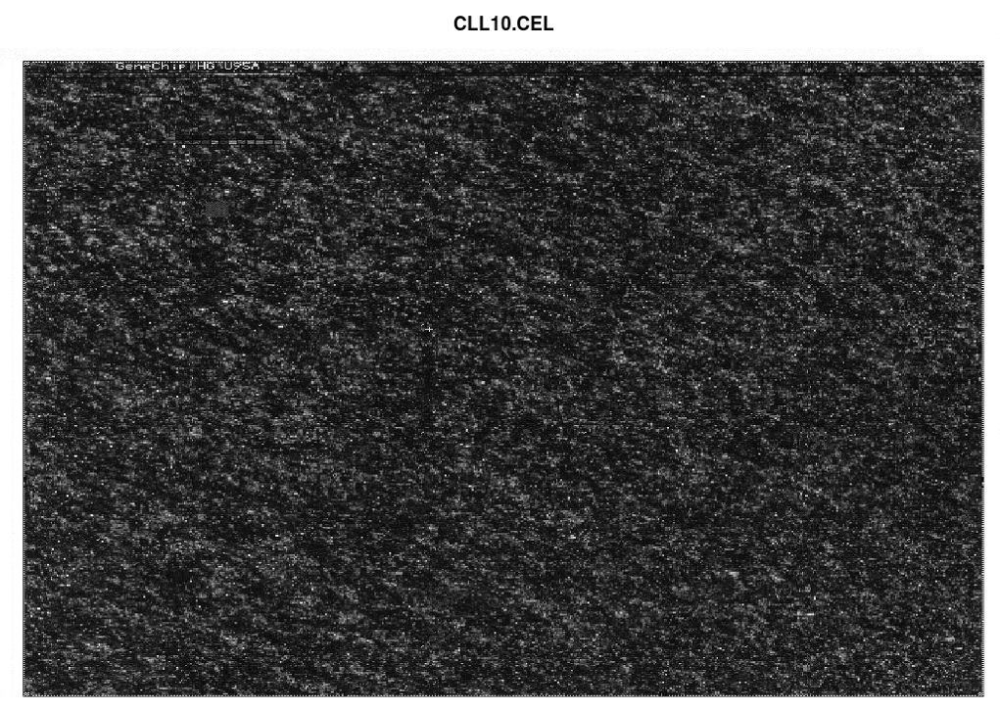
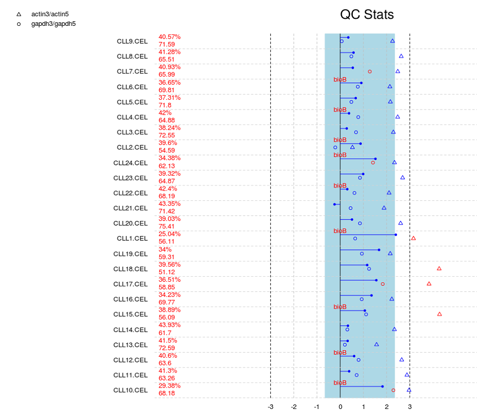
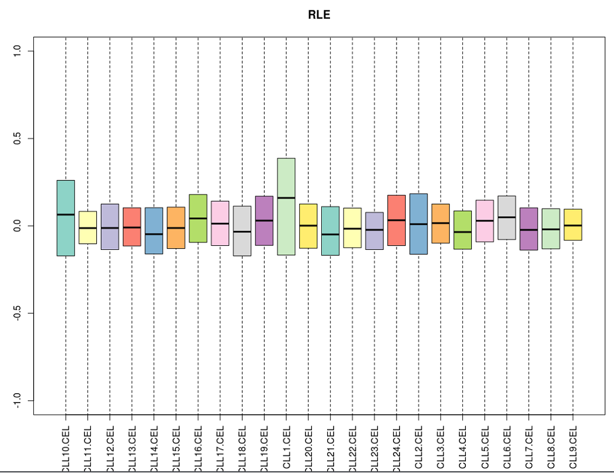
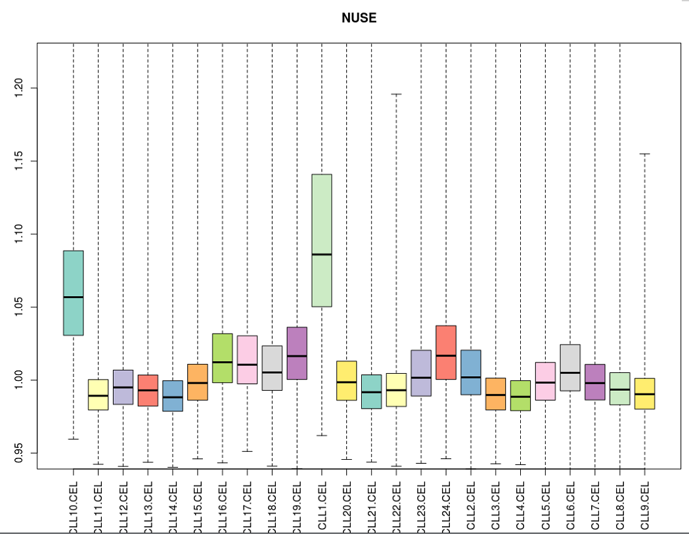
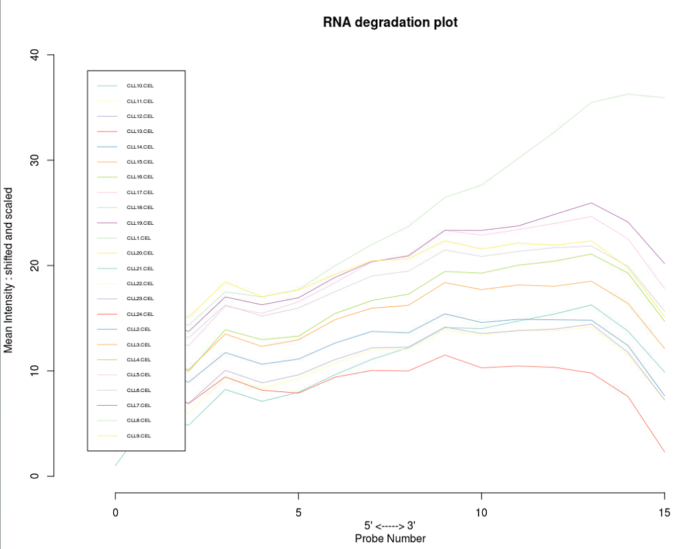
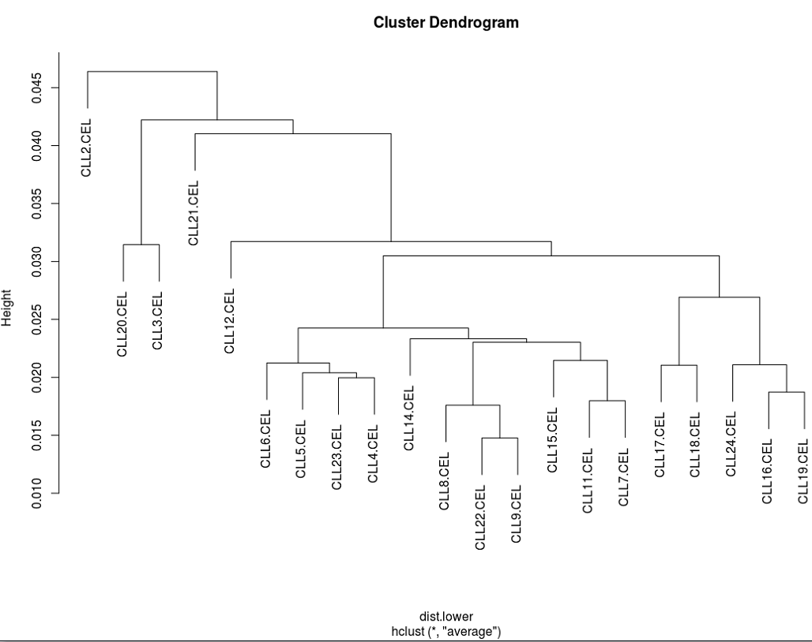
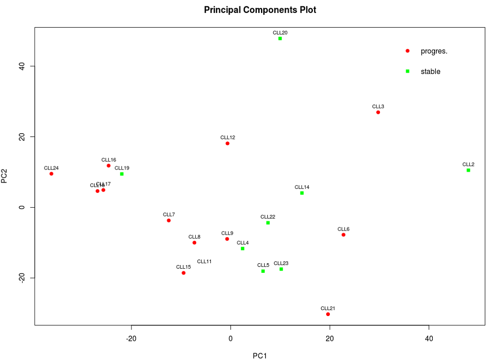

# Bioconductor分析基因芯片数据

*参考学习《R语言与Bioconductor——生物信息学应用》第五章*

**Bioconductor最初就是设计来分析基因芯片数据的，因此芯片分析整体反映了Biocondutor的设计理念和编程思想。**

## 快速入门

通过一个例子了解如何载入芯片数据，完成预处理，最后获得基因（探针组）表达矩阵。

```R
# install CLL package
# library(BiocInstaller)
# biocLite("CLL")

# 载入CLL包，CLL包会自动调用affy包，该包含有一系列处理函数
library(CLL)
# read example dataset，（CLL包附带的示例数据集）
data("CLLbatch")
# pre-process using RMA method
CLLrma <- rma(CLLbatch)
# read expression value after pre-processing
e <- exprs(CLLrma)
# 查看部分数据
e[1:5, 1:5]
```

数据输出如下：

```R
> e[1:5, 1:5]
          CLL10.CEL CLL11.CEL CLL12.CEL CLL13.CEL CLL14.CEL
100_g_at   7.495697  7.945159  7.861043  7.990252  7.889718
1000_at    7.251120  8.298723  8.473531  8.131041  8.051400
1001_at    4.457362  4.517529  4.357791  4.651236  4.473598
1002_f_at  3.984693  3.981675  4.065171  4.132480  4.065022
1003_s_at  6.437046  6.200826  6.412218  6.313572  6.105120
```

对象`e`是一个12625行、24列的基因表达矩阵。可以看到，我们仅用了不到10行代码就完成了整个芯片的预处理过程。

**关于探针组**

> 一张基因芯片包含上百万的探针，它们被整齐有序地印刷再芯片上。探针组（probe set）来自于一个基因，通常由20对或者11对探针组成。每一对探针都由匹配探针（PM）和错配探针组成，称为探针对。
>
> 探针序列地来源叫做参考序列，通常来自于公开的核酸数据库。不同的芯片类型，探针组在参考序列中的分布不同。
>
> 这里有一个概念误区需要注意：芯片数据中的基因表达矩阵往往是以探针组而不是以基因为单位的，每行都对应一个探针组的表达量。我们一般通过ID映射才对应到探针组代表的基因，它们的关系常常为多个探针组对应一个基因。实际应用中则不太注意区分。

**关于芯片文件格式**

> 芯片实验结果获取数据主要通过两个步骤，第一步由扫描设备对芯片进行扫描，得到荧光信号图像文件（DAT文件）；第二步由系统自带的图形处理软件进行一系列图形处理与识别，从芯片图像中提取数据，得到CEL文件。
>
> Affymetrix芯片原始数据最常用格式为CEL格式，也是芯片数据预处理和分析的出发点。
>
> **CEL文件只提供了每个探针的灰度信息，还需要基因芯片探针排布的信息（哪个探针来自哪个探针组），才可以得到芯片上每个探针组对应的表达数据，这就需要CDF文件。**另一个重要的文件是Probe文件，它提供了探针的序列信息。
>
> 除了上述提到的几种文件格式，常见的还有EXP文件、CHP文件、TXT文件和RPT文件。TXT文件特指包含基因表达矩阵的TXT文件，CHP文件与TXT文件内容基本相同。


## 数据预处理

预处理的目的是**将探针水平的数据转换成基因表达数据**。主要的数据结构有AffyBatch类和ExpressionSet类，前者用于存储探针水平数据（相当于CEL文件内容），而后者用于存储表达水平的数据（基因表达矩阵）。

预处理通过质量控制，剔除不合格的芯片数据，只保留合格的进入下一步处理。然后通过标准化，将所有芯片数据中的基因表达值变换到一个可以比较的水平，用于后续分析。

### 数据输入

实际应用中，常见情况是从CEL文件中获得数据。在上一个例子中，数据包CLL中得到的芯片数据基本等同于CEL文件。

**无论是数据包还是文件输入，读入的数据会存入一个AffyBatch类型的对象中。**

```R
# load package
# library(CLL)

# load data
data(CLLbatch)

# view the data type
data.class(CLLbatch)

# load status info of all samples
data(disease)
# view
disease

# see help of AffyBatch
help("AffyBatch")
```

看一下输出的一些结果：

```R
> data.class(CLLbatch)
[1] "AffyBatch"
> disease
   SampleID  Disease
1     CLL10     <NA>
2     CLL11 progres.
3     CLL12   stable
4     CLL13 progres.
5     CLL14 progres.
6     CLL15 progres.
7     CLL16 progres.
8     CLL17   stable
9     CLL18   stable
10    CLL19 progres.
11     CLL1   stable
12    CLL20   stable
13    CLL21 progres.
14    CLL22   stable
15    CLL23 progres.
16    CLL24   stable
17     CLL2   stable
18     CLL3 progres.
19     CLL4 progres.
20     CLL5 progres.
21     CLL6 progres.
22     CLL7 progres.
23     CLL8 progres.
24     CLL9   stable
```

> CLL数据集存储了24位癌症病人样本的数据，所有病人根据健康状态分为两组：稳定期（Stable）组和进展组（Progressive）。


**AffyBatch类**

> Biobase软件包中，AffyBatch类是从一个更基础的类eSet类衍生来的。eSet类非常重要，它被写成了一个虚类，衍生出许多非常重要的类，包括ExpressionSet类，SnpSet类以及AffyBatch类等。eSet是Bioconductor为基因表达数据格式所定制的标准，因此非常有必要熟悉eSet及其衍生类。

```R
> phenoData(CLLbatch)
An object of class 'AnnotatedDataFrame'
  sampleNames: CLL10.CEL CLL11.CEL ... CLL9.CEL (24 total)
  varLabels: sample
  varMetadata: labelDescription
> featureData(CLLbatch)
An object of class 'AnnotatedDataFrame': none
> protocolData(CLLbatch)
An object of class 'AnnotatedDataFrame': none
> annotation(CLLbatch)
[1] "hgu95av2"
> exprs_matrix <- assayData(CLLbatch)[[1]]
> exprs_matrix[1:5, 1:5]
  CLL10.CEL CLL11.CEL CLL12.CEL CLL13.CEL CLL14.CEL
1     183.0     113.0     119.0     130.0     133.0
2   11524.8    6879.8    7891.3    8627.5    8205.3
3     301.0     146.0     133.0     160.0     153.0
4   11317.0    6747.0    7916.0    8616.0    7865.0
5     115.0      82.0      78.8     101.0      65.3
> exprs(CLLbatch)[1:5, 1:5]
  CLL10.CEL CLL11.CEL CLL12.CEL CLL13.CEL CLL14.CEL
1     183.0     113.0     119.0     130.0     133.0
2   11524.8    6879.8    7891.3    8627.5    8205.3
3     301.0     146.0     133.0     160.0     153.0
4   11317.0    6747.0    7916.0    8616.0    7865.0
5     115.0      82.0      78.8     101.0      65.3
```

- assayData槽是AffyBatch类必不可少的，其方法返回结果的第一个元素是矩阵类型，用于保存基因表达矩阵。该矩阵的行对应不同的探针组，用一个无重复的索引值表示；列对应不同的样本。当使用exprs方法时，调取的就是这个基因表达矩阵。
- experimentData槽是一个MIAME（Minimum Information About a Microarray Experiment）类型的数据，设计这个MIAME类的目的就是用于保存MIAME原则建议的注释信息。该原则建议了一组标准用来记录与基因芯片实验设计相关的资料。

结果中可以看到`phenoData(CLLbatch)`结果没有每个样品对应的表型信息。因为CLL包采用了一个数据框类型的变量disease来保存每个样本的表型信息。其实，将表型信息存入数据结构CLLbatch中是更为规范的做法。


### 质量控制

这里的质量控制主要集中在CEL文件级别的处理，**从最简单的直接观察，到平均值方法，再到比较高级的数据拟合方法**。这三个层次的质量控制功能分别由image函数、simpleaffy包和affyPLM包实现。

我们先直观地看一下芯片上所有位点的灰度图像。

```R
# 查看第一张芯片的灰度图像
image(CLLbatch[,1])
```



芯片左上角的花纹和芯片名称可以帮助我们来了解芯片数据是否可靠。根据图像信息，可以对芯片的信号强度产生一个总体认识：图像特别黑，信号强度低；图像特别亮，信号可能过饱和。


很显然这种方法非常粗糙，不能量化。比它好的简单方法是基于各种平均值的方法。**这类方法的一个共同特点就是假设一组实验中的每个芯片数据对于某个平均值指标都相差不大**。Affymetrix公司在指导手册中进行了详细描述。

- 尺度因子（Scaling factor）：用于比较地芯片之间地尺度因子地比例必须小于3
- 检测值（Detection call）和检出率（Percent present）：一组探针能否被检测到，用检测值有（Present，简称P）、无（Absent，简称A）和不确定（Marginal present，简称M）来表示。
- 平均背景噪声（Average background）
- 标准内参（Internal control genes）:大部分的细胞有$\beta$-actin和GAPDH基因...

根据上述的这些标准，使用Bioconductor的simpleaffy包对Affymetrix芯片数据进行质量评估，最后得到质量控制总览图。

```R
## use simpleaffy package
library(BiocInstaller)
biocLite("simpleaffy")
library(simpleaffy)
library(CLL)
data(CLLbatch)
# acquire analysis report
Data.qc <- qc(CLLbatch)
# visualize report
plot(Data.qc)
```



上图显示的是全部数据的质量控制总览图。第一列是所有样本的名称；第二列是两个数字，上面的是以百分比形式出现的检出率，下面的数字表明平均背景噪声。第三列（“QC Stats”）最下面的横轴是尺度因子等指标对应的坐标，取值范围从-3到3。第3列用到了三项指标：尺度因子、GAPDH 3'/5' 比值和actin 3'/5'比值，分别用实心圆、空心圆和三角标志表示出来。如果出现红色的“bioB”字样，说明该样品中未能检测到BioB。

简单地讲，**所有指标出现蓝色表示正常，红色表示可能存在质量问题**。但这样根据实际情况进一步分析。一般来讲，如果有一个芯片各项指标都不太正常，尤其是BioB无法检测到，建议判定该芯片实验失败。比如CLL15.CEL这个数据的检出率明显低于其他样品，actin3/actin5远大于3，而且没有检测到BioB，因此数据可以判定为无效。


**基于平均值假设的评价指标都有一个默认的假设，那就是对于每一块芯片，质量是均匀的，不会随位置不同发生较大的变化**。但事实上，芯片的每一个小格之间的质量也是有差异的。

如何得到比较可靠的质量评估呢？这需要设计多种能反映芯片数据全貌的指标综合分析从而得到最终的结论。**这些指标要在对原始数据拟合的基础上计算得到**，以图形显示，包括权重残差图、相对对数表达箱线图、相对标准差箱线图、RNA降解曲线、聚类分析、主成分分析、信号强度分布图与MA图等等。以上功能可以通过affyPLM包实现。

```R
## use affyPLM package
biocLite("affyPLM")
library(affyPLM)
library(CLL)
data(CLLbatch)
# 对数据集做回归分析，结果为一个PLMset类型的对象
Pset <- fitPLM(CLLbatch)
image(CLLbatch[,1])
# 根据计算结果，画权重图
image(Pset, type="weights", which=1, main="Weights")
# 根据计算结果，画残差图
image(Pset,  type="resids", which=1, main="Residuals")
# 根据计算结果，画残差符号图
image(Pset, type="sign.resids", which=1, main="Residuals.sign")
```

affyPLM包在探针水平拟合时引入了加权最小二乘法来进行回归，理论上，权重和残差 的分布是随机的，应该看到绿色均匀分布的权重图和红蓝均匀分布的残差图。

相对对数表达箱线图（RLE）反映了基因表达量的一致性趋势，它**定义为一个探针组在某个样品的表达值除以该探针组在所有样品中表达值的中位数后取对数**。

如果使用RLE箱线图来控制CLL数据集的实验质量，**每个样品的中心应该非常接近纵坐标0的位置**。如果个别样品的表现与其他大多数明显不同，那说明可能这个样品可能有问题。下面我们根据这个数据集来看看。

```R
## 
biocLite("RColorBrewer")
# library(affyPLM)
library(RColorBrewer)
colors <- brewer.pal(12, "Set3")
# RLE
Mbox(Pset, ylim=c(-1, 1), col=colors, main="RLE", las=3)
# NUSE
boxplot(Pset, ylim=c(0.95, 1.22), col=colors, main="NUSE", las=3)
```



NUSE是一种比RLE更为敏感的质量检测手段。我们可以结合NUSE图来确定是否某个芯片质量有问题。NUSE定义为一个探针组在某个样品的PM值的标准差除以该探针值在各样品中的PM标准差的中位数。**如果所有芯片的质量都是非常可靠的话，那么它们的标准差会非常接近，因此它们的NUSE值都会在1附近**。

> 然而，如果有些芯片质量有问题的话，就会严重地偏离1，进而导致其他芯片地NUSE值偏向相反的方向。当然，存在一种极端的情况，就是大部分芯片都出问题了，但是它们的标准差却比较接近，反而会显得没有质量问题的芯片的NUSE值会明显偏离1，所以必须结合两种图作出可靠的判断。



可以看到CLL1和CLL10的质量明显有别于其他样品，需要舍弃。

**RNA降解是影响芯片质量的一个很重要因素**。因为RNA是从5’端开始降解的，理论上5‘端的荧光强度应该低于3’端的荧光强度。如果RNA降解曲线的斜率太小，甚至接近于0，很可能是RNA降解太严重，需要作为坏数据去除（下图显示的CLL13）。

```R
# RNA degradation
# library(affy)
data.deg <- AffyRNAdeg(CLLbatch)
plotAffyRNAdeg(data.deg, col=colors)
legend("topleft", rownames(pData(CLLbatch)), col=colors, lwd=1, inset=0.05, cex=0.5)
```



```R
CLLbatch <- CLLbatch[, -match(c("CLL10.CEL", "CLL1.CEL", "CLL13.CEL"),
                              sampleNames(CLLbatch))]
```

去掉三个质量差的。

前面提到的质量控制方法都是基于平均值思想的，其实，我们还可以从芯片之间的相互关系来检验芯片的质量。理论上组内同种类型的芯片数据应该聚拢在一起，两个组之间应该明显地分离。Pearson线性相关系数就是最常用的这类指标，但在实际应用中，往往不是直接查看相关系数矩阵，而是根据由相关系数矩阵导出的距离矩阵，进行聚类分析或主成分分析以对样品归类并图形化显示。

```R
## cluster and PCA
# install packages
biocLite("gcrma")
biocLite("graph")
biocLite("affycoretools")

# load packages
library(CLL)
library(gcrma)
library(graph)
library(affycoretools)

# load data
data(CLL)
data(disease)
# pre-process using gcrma
CLLgcrma <- gcrma(CLLbatch)
# retrieve gene expression dataset
eset <- exprs(CLLgcrma)
# compute Pearson corr coeffience
pearson_cor <- cor(eset)
dist.lower <- as.dist(1 - pearson_cor)
# cluster
hc <- hclust(dist.lower, "ave")
# plot
plot(hc)
# PCA
samplenames <- sub(pattern = "\\.CEL", replacement = "", colnames(eset))
groups <- factor(disease[,2])
plotPCA(eset, addtext=samplenames, groups=groups, groupnames=levels(groups))
```



从聚类分析的结果来看，稳定组和恶化组根本不能很好分开。这还不能判定实验失败。**理论上讲，如果总体上两组数据是分开的，那么说明我们关心的导致癌症从稳定到恶化的因素起到了主要因素。如果不是，需要具体问题具体分析。**CLL数据的实验样本来自不同个体，而不是细胞，很可能个体差异起到了主导作用，因此导致聚类被整体打乱。所以只有当聚类图中有明显的类别差异时，才适合考虑去除个别不归类的样品；如果整体分类被打乱，则不能简单判定所有样品都出了问题。

芯片分析往往采用两个主成分来构建分类图，我们从下图可以看出两组根本就不能很好分开。



注意，使用主成分分析时，还必须考虑前2个主成分是否具有代表性，这要看前2个主成分的累计贡献率，如果低于60%，可以考虑采用多维尺度分析来构建分类图。


### 背景校正、标准化和汇总


## 基因芯片数据分析


### 选取差异表达基因


### 注释


### 统计分析及可视化


